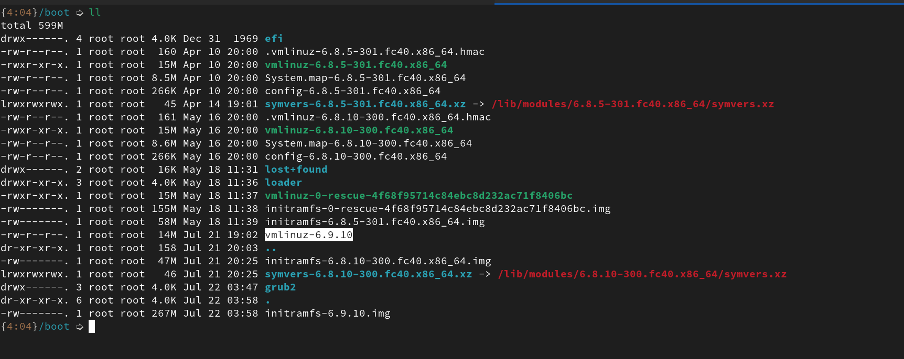
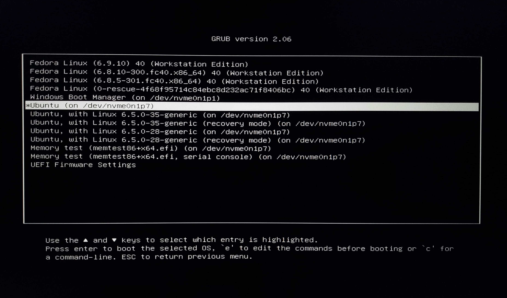

> Disclaimer: Info here is from: [LDF103](https://training.linuxfoundation.org/training/a-beginners-guide-to-linux-kernel-development-lfd103/)


# clone the stable release

```
git clone git://git.kernel.org/pub/scm/linux/kernel/git/stable/linux-stable.git linux_stable
cd linux_stable
```
---

switch to latest stable branch

```
git branch -a                                 
* master
  remotes/origin/HEAD -> origin/master
  remotes/origin/linux-2.6.11.y
  ...
  remotes/origin/linux-6.7.y
  remotes/origin/linux-6.8.y
  remotes/origin/linux-6.9.y
  remotes/origin/linux-rolling-lts
  remotes/origin/linux-rolling-stable
  remotes/origin/master

git switch remotes/origin/linux-6.9.y
```
---

# generating .config

- copy the current configuration, into `linux_stable` directory

```
ls /boot # look for config-...-generic
cp /boot/config-...-generic /path/to/linux\_stable
```
---

- genereate `.config` based on current configuration

```
make oldconfig
```

- keep pressing enter to set default options, or choose what features you need

# install dependencies

- these are the dependencies that I had to install; yours might be different
  based on configuration

```
sudo apt-get install build-essential vim git cscope libncurses-dev libssl-dev bison flex libelf-dev
```

# compile the kernel

- run the command 

```
make -jN
```

- where `N` is number of threads on your CPU

```
make -j$(nproc)
```
- if it gives an error like \<xyz.h\> missing, then install the missing dependencies

- after successfull compilation, `vmlinux` binary would be generated

# install the kernel

```
make modules_install
sudo make install
```
---

```
sudo su                                                                                            
[sudo] password for kaku: 
make modules_install install
  SYMLINK /lib/modules/6.9.10/build
  INSTALL /lib/modules/6.9.10/modules.order
    ...other drivers 
  INSTALL /lib/modules/6.9.10/kernel/net/qrtr/qrtr-mhi.ko
  SIGN    /lib/modules/6.9.10/kernel/net/qrtr/qrtr-mhi.ko
  DEPMOD  /lib/modules/6.9.10
  INSTALL /boot
```

---

# check your new kernel in /boot



<!--
capture dmesg

root@192:/home/kaku/Documents/bug_fix_2024/lfd103/4# dmesg -t > dmesg_current
dmesg -t -k > dmesg_kernel
dmesg -t -l emerg > dmesg_current_emerg
dmesg -t -l alert > dmesg_current_alert
dmesg -t -l crit > dmesg_current_crit
dmesg -t -l err > dmesg_current_err
dmesg -t -l warn > dmesg_current_warn
dmesg -t -l info > dmesg_current_info
root@192:/home/kaku/Documents/bug_fix_2024/lfd103/4# exit
-->

# update grub configuration

- there is no gurantee that newly installed kernel will boot
- need to ensure that there is atleast one **good kernel** to boot from
- increase the `GRUB\_TIMOUT` to make grub allow us enough time to be able to
  select kernel to  boot
- in `/etc/default/grub`

# enable early messages

- if the new kernel fails to boot; we should be able to see **early messages**
  to debug why it failed to boot
- enable early messages by changing `GRUB_CMDLINE_LINUX` to `earlyprintk-=vga`

```
GRUB_CMDLINE_LINUX="earlyprintk=vga"
```
- in `/etc/default/grub`
- run `sudo update-grub` to update grub configuration

# restart the system



---

- boot into the new kernel
- check kernel verison to confirm


```
$ uname -r
6.9.10
```

# new kernel fails to boot

- if kernel fails to boot; compare dmesg of your old kernel and newly build
  kernel to check for regressions (Checking whether changes to software have broken functionality that used to work).


---

> Thank You
