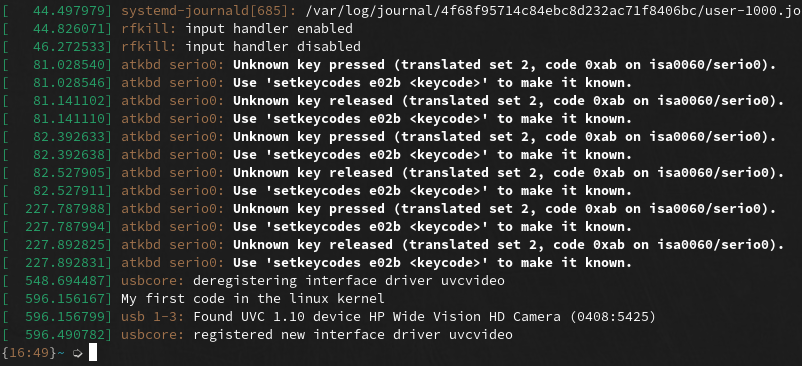

# linux kernel configuration

- drivers configuration options
    1. Disabled: "n"
    2. Built into the kernel (vmlinux image) to be loaded at boot time: "y"
    3. Built as a module to be loaded as needed using `modprobe`: "m"

modules **(.ko)** files can be loaded when kernel detects hardware that matches
the driver

---

- new releases often introduce new configuration variables or rename
  configuration symbols (in which case `make oldconfig` will not produce a working
kernel)
- run `make listnewconfig` to see list of new configuration symbols

refer [_this-doc_](https://www.kernel.org/doc/html/latest/kbuild/kconfig.html)
for kconfig and `make config`

and [_this-doc_](https://www.kernel.org/doc/html/latest/kbuild/index.html) to
learn about kernel build process

# writing patch

- add remote; so you can fetch changes and choose a tag to rebase from

```
git remote add linux git://git.kernel.org/pub/scm/linux/kernel/git/torvalds/linux.git
git fetch linux
```

- create new branch in `linux_mainline`

```
git checkout -b test_patch
```

# make change to a driver

- run `lsmod` to list modules loaded on your system and 
- we will make a change to `uvcvideo` driver
- now you have to find `.c`,`.h` files; in linux kernel repository

searching Makefile can lead you there; `git grep` will get you there faster;
since it ignores generated `.o`, `.ko`, ... files and `.git` folder

---

> uvcvideo is a USB Video Class (UVC) media driver for video input devices,
> such as webcams. It supports webcams on laptops. 

Let’s check the source files for this driver.

```
ls drivers/media/usb/uvc/
```
---

Let's make a small change to the **probe function** of the uvcvideo
driver. A probe function is called when the driver is loaded. Let's edit
`uvc_driver.c`:

- find the `uvc\_probe` function; add `pr\_info("your message");` to it;
- A pr\_info() function writes a message to the kernel log buffer, and
  we can see it using dmesg.

---

```
vim drivers/media/usb/uvc/uvc_driver.c
```
```c
static int uvc_probe(struct usb_interface *intf,
                     const struct usb_device_id *id)
{
        struct usb_device *udev = interface_to_usbdev(intf);
        ...
        int ret;

        pr_info("I changed uvcvideo driver in the Linux Kernel\n"); //Add this

        if (id->idVendor && id->idProduct)
        ...
}
```

---

- To make `uvcvideo` compiled as module; change
  `CONFIG_USB_VIDEO_CLASS=m`; in the Makefile

- Or you can built it into the kernel using "y" option

---

# time to test your change

Recompile your kernel and install. Then try unloading and loading the module and you should see your message

- Unload module
    - using: `sudo rmmod uvcvideo`
    - Check `dmesg` for any messages about the uvcvideo module removal.
    - Run `lsmod | grep uvcvideo`, Do you see the module?

- Load module:
    - using: `sudo modprobe uvcvideo`
    - Run `lsmod | grep uvcvideo`. Do you see the module?
    - Run `dmesg | less` and search for "your message". Do you see the message?

---


