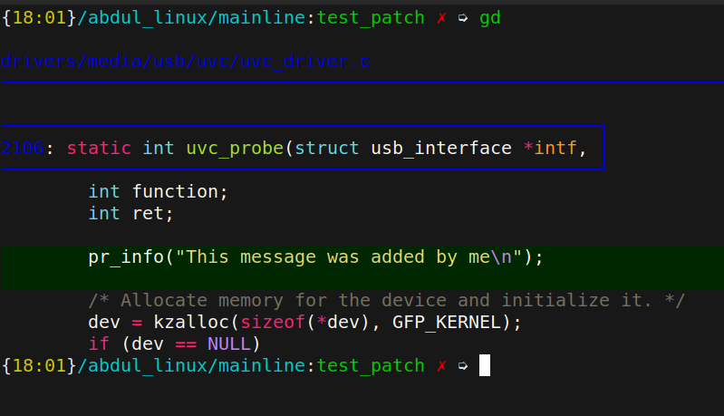
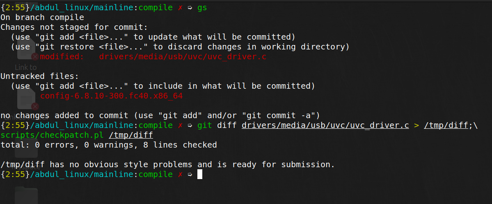

# preparing patches

- ensure that your code conforms **linux kernel coding style**
- a script `checkpatch.pl` is provided; which you can run off of `diff`

```
git diff /path/to/changed/file  /tmp/df; \
    scripts/checkpatch.pl /tmp/df
```

- run checkpatch.pl **before testing or commmiting** changes 
- make necessary changes and fix warning/errors generated by the script

---


---

once checkpatch is happy; test your changes and commit your change

```
git commit -a # to commit all changes
git commit <filenames> # in case you want to send changes as seprate patches
```

---



---



---

# commit conventions

- commit message has a short subject; and a description/longer commit message;
- Explain: **why the code change is needed**, instead of **what code does**. Checkout [_how to write a git commit_](https://cbea.ms/git-commit/)

- begin the commit message with a single short (less
  than 50 character) line summarizing the change, followed by a blank
line and then a more thorough description. 
- The **text up to the first blank line** in a commit message is treated as the commit **title**, and that title is used throughout Git.  For example, **Git-format-patch(1) turns
a commit into email, and it uses the title on the Subject line and the
rest of the commit in the body.**

# generate patch

- After committing the change, generate the patch running the following command:

```
git format-patch -1 <commit ID>
```
- do not use the dont use --pretty option. Because then
  `git send-email` doesn't work.

# sending your patch

send your patch using the command:

```
git send-email --to=email@gmail.com /path/to/patch
```

